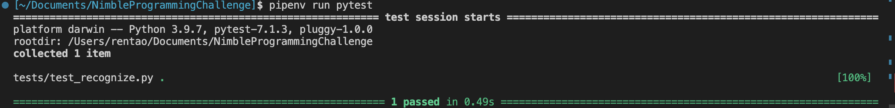

## WebRTC Object Detection By OpenCV

## Demo Video
[have a look](https://pitt-my.sharepoint.com/:v:/g/personal/tar118_pitt_edu/Ea8a5zplTHhHpVK-OTAzrZEBADeEA9BtdW__y7CLSq8r2w?e=mPH6Vl)

### Dependencies
- Linux(Ubuntu 20.04 recommended)
- Python3(3.9recommended)
- Python numpy(http://www.numpy.orgl)
- Python opencv(https://pypi.org/project/opencv-python/)
- Pythonaiortc(https://github.com/aiortc/aiortc)
- Python multiprocessing(https://docs.python.org/3.9/ibrary/multiprocessing.html)

### Requirements
1. Make a server python program that runs from the command line(python3 server.py)
2. Make a client python program that runs from thecommand line(python3 client.py)
3. Using aiortc built-in TcpSocketSignaling:
   - The server should create an aiortc offer and send to client
   - The client should receive the offer and create an aiortc answer
4. The server should generate a continuous 2D image of a ball bouncing across the screen.
5. The server should transmit these images to the client via aiortc using frame transport(extend aiortc.MediaStreamTrack)
6. The client should display the received images using opencv
7. The client should start a new multiprocessing.Process(process_a)
8. The client should send the received frame to this process_a using a multiprocessing.Queue
9. The client process_a should parse the image and determine the current location of the ball as x,y coordinates.
10. The client process_a should store the computed x,y coordinate as a multiprocessing.Value.
11. The client should open an aiortc data channel to the server and send each x,y coordinate to the server.
These coordinates are from process_a but sent to server from client main thread.
1.  The server program should display the received coordinates and compute the error to the actual location of the ball.
2.  Document all code using python docstrings.
3.  Write unit tests for all functions which will be executed by pytest(pytest test_YOUR_SCRIPT.py)
4.  Include a README file.
5.  Include a screen capture(mp4, mkv, avi, etc.) of your application in action.
6.  Compress the project directory and include your name in the filename. 
7.  Docker and Kubernetes:
    - Make a docker container for the server
    - Make a docker container for the client
    - Use minikube to create deployment of server and client.

## Features

* [x] Using `aiortc` built-in TCPSocketSignaling to setup server and client

* [x] The Server generates continuous 2D bouncing ball images

* [x] The Server transports these images by `MediaStreamTrack`

* [x] The Client receives images on the socket

* [x] The Client displays the images by `opencv`

* [x] The Client starts a new process to handle the recognition task

* [x] The Client transports data between process using `Queue`, `Value` in `multiprocessing`

* [x] The Client parses the image and gets the position of the bouncing ball Using `opencv`

* [x] The Client transports predicted position to the server using data channel.

* [x] The Server print the received coordinates and compute the error to the actual position

* [x] Docstrings

* [x] Pytest

* [x] Demo Video

* [x] Build Docker Image

* [x] Run different docker container with env ROLE


## Dependency Manager
[Pipenv](https://docs.pipenv.org/install/#installing-packages-for-your-project)

### install pipenv
```bash
pip install pipenv
```

### pipenv install
Install all dependencies for your python project.
```bash
pipenv install
```

Or install a specific dep
```bash
pipenv install pytest
```

### pipenv run
In specific env to run your python file with deps.
```bash
# launch the server first
pipenv run python server.py
pipenv run python client.py
```

### Launch without Pipenv
In `Pipfile`, there are all deps and python version.
You can install them by yourself so that you don't need pipenv to run.
```bash
pip install numpy aiortc opencv-python pytest
```

## Files
- \_\_init\_\_.py: module file
- client.py: entry of the client
- server.py: entry of the server
- ball.py: draw a ball as VideoStreamTrack
- debugPrint.py: print tool
- displayFrame.py: using opencv to display track
- recognition.py: using opencv to get position of the ball
- drawBall.py: just a test file to draw a bouncing ball
- process_recognize_sim.py: test file
- Dockerfile: docker file to build docker image
- dockerFile.tgz: compressed file to build docker image
- Pipfile: deps file generated by pipenv
- Pipfile.lock: deps lock file generated by pipenv
- README.md: README
- startup.sh: start up file for docker container
- tests/ : pytest files in this folder
- images: some images using in README
- demo.mp4: demo video


## Run Pytest
```bash
pipenv run pytest
```


## Docker

### Compress files to load
```bash
tar -czf dockerFiles.tgz WebRTCObjectDetection
```

### Build Docker Image
```bash
docker build -t taskServer:v1 .
```

### Run Docker Container

Launch a container as the Server

```bash
docker run -d --name task_server -e ROLE="server" -p 8080:8080 -it taskServer:v1 bash
```

Launch a container as the Client

```bash
docker run --name task_client -e ROLE="client" -p 8080:8080 -it taskServer:v1 bash
```

### Attach a container

```bash
docker attach [dockerid]
```


